# SEASKY-K210-YOLO-DEMO

### **@版权所有->刘威**

### **LICENSE:** **MIT License**

### 个人博客：<a href="https://seasky-master.github.io/SEASKY-Master/">https://seasky-master.github.io/SEASKY-Master/</a>

代码基于`Kendryte K210 standalone SDK`开发、有修改 SDK 中部分代码。

除 SDK 外的代码位于`xx/src/hello_world`,如果你需要使用自己的代码可以删除 hello_world 目录下的代码，然后将自己代码复制到该目录。
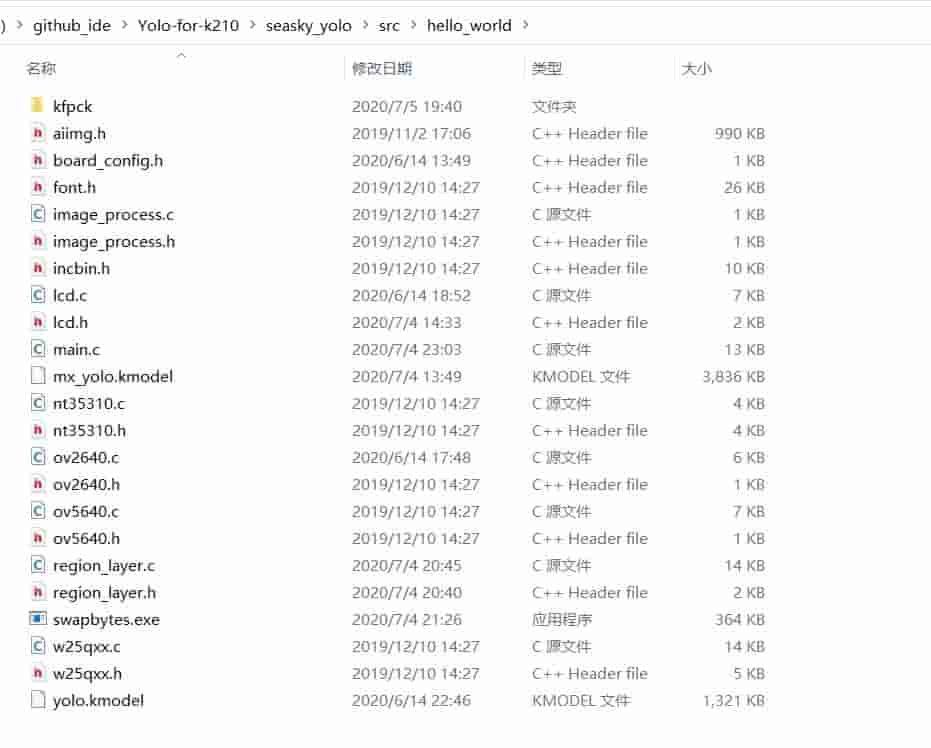

下面开始进入正题

## 硬件设计

- <a href="https://github.com/SEASKY-Master/SEASKY_K210">SEASKY-K210</a>

  
  
  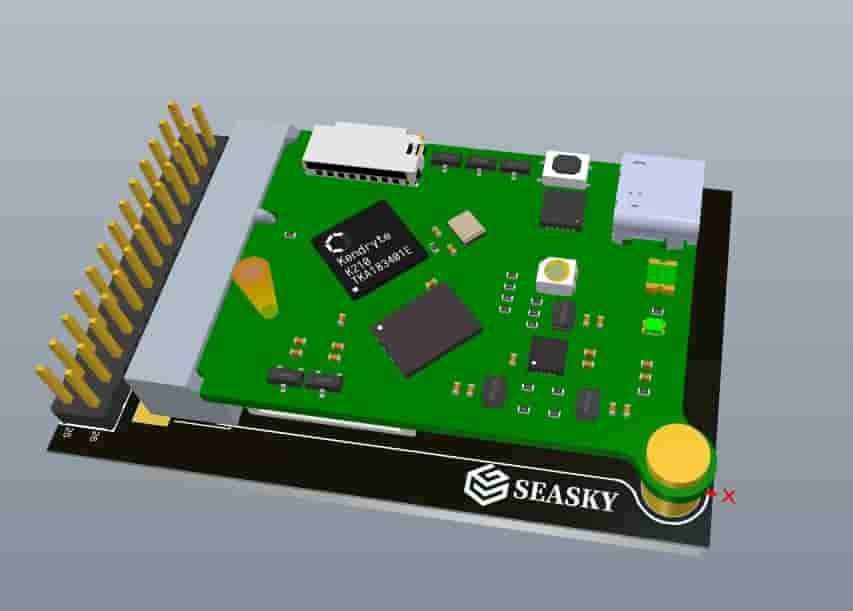

## Windows 命令行开发环境搭建

1. 下载 <a href="https://cmake.org/download/">cmake V3.0</a>之后的 Windows 版本，把 cmake 安装到 D:\cmake 目录，并把 D:\cmake\bin 目录添加到 PATH 环境变量。
2. 打开一个新的 cmd 窗口，输入 `cmake –version` 命令，若看到如下信息说明设置正确。
   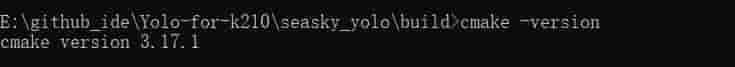

3. 从<a href="https://github.com/kendryte/kendryte-gnu-toolchain/releases">Kendryte Github</a>下载 Windows 版本工具链。 打开网页后展开 Assets 可看到下载链接。
   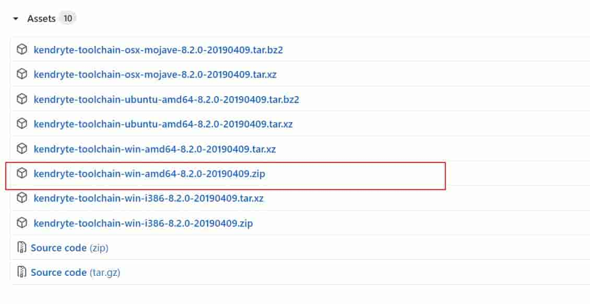

4. 配置环境变量
   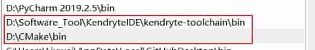

5. 重新打开一个 cmd 窗口，输入 `riscv64-unknown-elf-gcc –v`命令，看到如下信息说明编译器设置正确。
   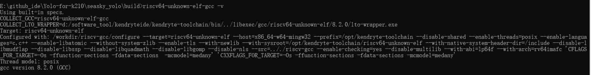
   到此开发环境搭建完成

6. 同时你还需要安装win下cmake依赖的编译工具、否则你将无法使用make，因此你还需要安装`MingW`，安装过程自己百度一下

## 源码编译（win）

注意：开始之前你需要删除 build 目录，同理如果你将完整的正常的代码复制到其他目录，然后重新编译，也需要先删除 build 目录

1.  打开 cmd 窗口
2.  cd 到源码目录
3.  使用`mkdir build`创建目录
4.  使用`cd build`跳转到`build`目录
5.  运行`cmake`

        cmake .. –DPROJ=hello_world –G “MinGW Makefiles”

    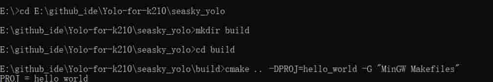
    如果输出以下结果正常
    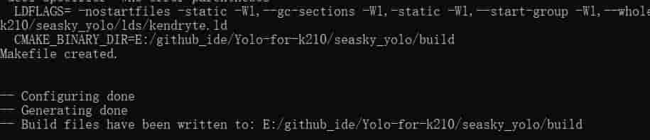

6.  在`build`目录下编译

        make -j

    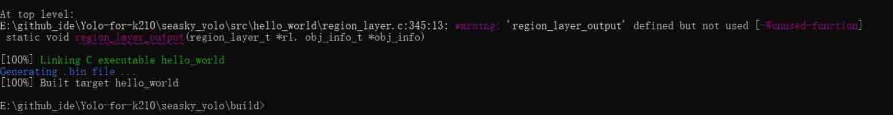

    编译后 build 目录下会生成`hello_world.bin`文件

7.  使用 k-flash-gui 下载`hello_world.bin`到开发板
    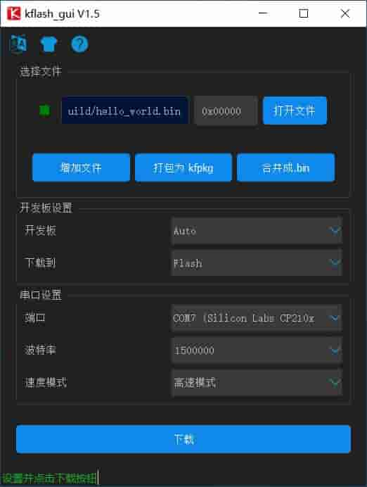
8.  效果展示
    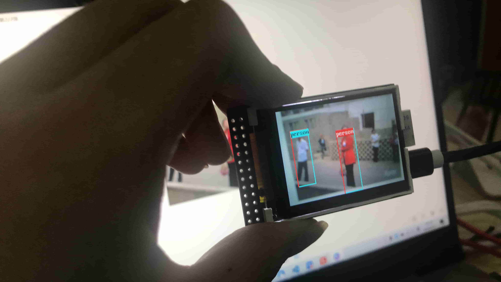

## 文本编辑-修改代码

1.  你可以使用几乎任何文本编辑器修改代码，因为编译是依赖于命名行、`cmake`和`toolchain`进行编译的,所以你可以选择你常用的代码编辑器去修改它。
2.  推荐使用`Visual Studio Code`
3.  如果你的 LCD 出现反色的现象
    请注释掉以下内容

             for(i = 0; i < tx_len; i++)
             {
                 buf[i] = buf[i] ^ 0xFFFFFFFF;
             }

该代码位于 spi.c 第 425 到第 428 行
`./lib/drivers/spi.c`
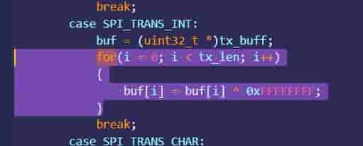

4.  注意，直接修改宏定义，不能直接改为 KD233 适用的代码
5.  代码支持 Widora 的 k210 板子、speed 的部分板子（当然颜色应该是反色的，因为他们都是使用的 2.4 寸及以上的 LCD，反色情况参照步骤 3)
6.  代码识别图像尺寸为 320\*224(深度学习小白，不会改训练模型的结构,他的 image-size 必须是 32 的倍数，不然会报错，因此仿照它提供的图片的代码修改底层 K210 代码去适应它提供的模型)。

### 其他编译方式参见 PaddlePi-K210 开发环境搭建指南

------------------------
------------------------

## **模型训练代码完全来源于<a href="https://github.com/zhen8838/K210_Yolo_framework">K210_Yolo_framework</a>，为了能在 win 上训练模型，你需要简单修改它的代码，我已经完成修改可以在 win 上运行**

## 你可以直接使用我修改后的代码<a href="https://github.com/SEASKY-Master/Yolo-for-k210">Yolo-for-k210</a>,或者你尝试使用原来的代码自行修改

### 个人博客：<a href="https://seasky-master.github.io/SEASKY-Master/">https://seasky-master.github.io/SEASKY-Master/</a>

### K210 YOLO V3 框架

## 这是一个清晰的、可扩展的 yolo v3 框架。

1. Real-time display recall and precision
2. Easy to use with other datasets
3. Support multiple model backbones and expand more
4. Support n number of output layers and m anchors
5. Support model weight pruning
6. Portable model to kendryte K210 chip

## VOC 数据集训练-开发环境

原作者在 ubuntu 18.04 - Python 3.7.1 中进行测试 ,
本人尝试可以在 windows 正常训练,你需要安装 requirements.txt 中的内容
优先安装 `tensorflow-gpu==1.15.0`,如果你的电脑不支持 GPU 版本，请安装 `tensorflow==1.15.0`
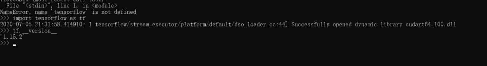
请在 `tensorflow` 环境搭建完成后继续向下操作，tensorflow 环境搭建参见`百度`

然后使用`pip install -r requirements.txt`安装其他工具

## 准备数据集

首次使用（确保你获取到了数据集）：

    准备数据集

数据集须存放在/Train_Image/MyImage
  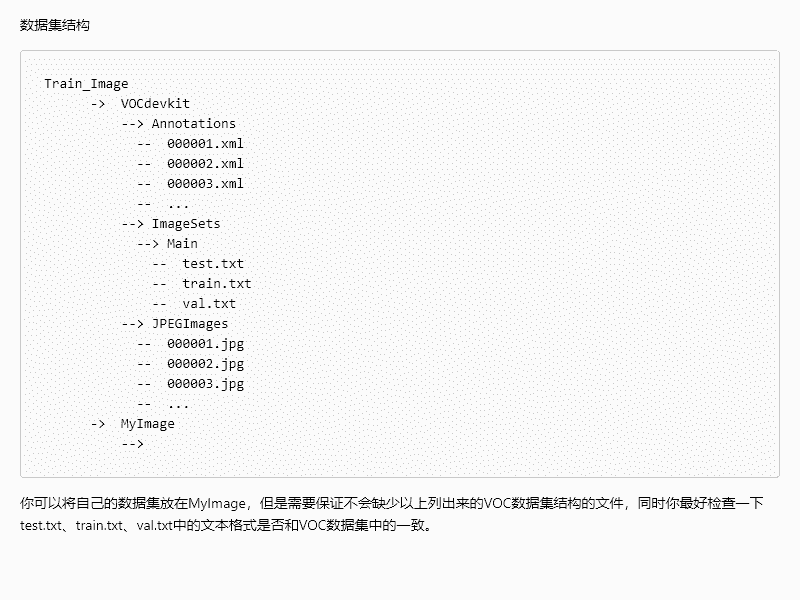
然后使用python生成需要的文件

datamaking.py

    仅根据Annotations和JPEGImages目录
    生成pscalvoc.txt、train.txt、val.txt、test.txt
    同时会删除多余或不配对的 .xml .jpg 运行时间较长
    数据按7：2：1分配
datamakingv2.py

    仅根据Annotations目录下文件的.xml文件生成需要的pscalvoc.txt、train.txt、val.txt、test.txt
    运行时间较短，适用于确认数据集一一对应的情况

生成label

    python voc_label.py
    cat  MyImage_train.txt MyImage_val.txt> train.txt   Linux使用此命令
    type MyImage_train.txt MyImage_val.txt> train.txt	  windowns使用此命令

注意：

- 改变路径后重新训练需从`python voc_label.py`从新开始

- win 不支持 wget，因此你需要安装相关工具，或直接在浏览器中输入 wget 后面的网址，下载后复制到改目录

然后将 IMG 路径和注释合并到一个 NPY 文件

    python make_voc_list.py train.txt data/voc_img_ann.npy

## 生成 anchors

加载注释生成 anchors(LOW 和 HIGH 视数据集的分布而定)：

    make anchors DATASET=voc ANCNUM=3 LOW="0.0 0.0" HIGH="1.0 1.0"

当你成功的时候，你会看到这样以下内容：
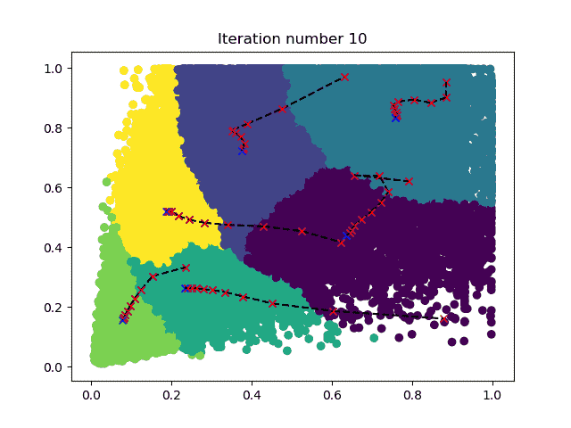

注：结果是随机的。当你有错误时，就重新运行它。

如果要使用自定义数据集，只需编写脚本并生成`data/{dataset_name}_img_ann.npy`，然后使用`make anchors DATASET=dataset_name`。更多选项请参见`python3 ./make_anchor_list.py -h`

如果要更改输出层的数目，则应修改 OUTSIZE 在 Makefile

## 下载预训练模型

你必须下载您想要训练的模型权重，因为默认情况下会加载训练前的权重。把文件放进./data 目录。

| `MODEL`       | `DEPTHMUL` | Url                                                                                | Url                                        |
| ------------- | ---------- | ---------------------------------------------------------------------------------- | ------------------------------------------ |
| yolo_mobilev1 | 0.5        | [google drive](https://drive.google.com/open?id=1SmuqIU1uCLRgaePve9HgCj-SvXJB7U-I) | [weiyun](https://share.weiyun.com/59nnvtW) |
| yolo_mobilev1 | 0.75       | [google drive](https://drive.google.com/open?id=1BlH6va_plAEUnWBER6vij_Q_Gp8TFFaP) | [weiyun](https://share.weiyun.com/5FgNE0b) |
| yolo_mobilev1 | 1.0        | [google drive](https://drive.google.com/open?id=1vIuylSVshJ47aJV3gmoYyqxQ5Rz9FAkA) | [weiyun](https://share.weiyun.com/516LqR7) |
| yolo_mobilev2 | 0.5        | [google drive](https://drive.google.com/open?id=1qjpexl4dZLMtd0dX3QtoIHxXtidj993N) | [weiyun](https://share.weiyun.com/5BwaRTu) |
| yolo_mobilev2 | 0.75       | [google drive](https://drive.google.com/open?id=1qSM5iQDicscSg0MYfZfiIEFGkc3Xtlt1) | [weiyun](https://share.weiyun.com/5RRMwob) |
| yolo_mobilev2 | 1.0        | [google drive](https://drive.google.com/open?id=1Qms1BMVtT8DcXvBUFBTgTBtVxQc9r4BQ) | [weiyun](https://share.weiyun.com/5dUelqn) |
| tiny_yolo     |            | [google drive](https://drive.google.com/open?id=1M1ZUAFJ93WzDaHOtaa8MX015HdoE85LM) | [weiyun](https://share.weiyun.com/5413QWx) |
| yolo          |            | [google drive](https://drive.google.com/open?id=17eGV6DCaFQhVoxOuTUiwi7-v22DAwbXf) | [weiyun](https://share.weiyun.com/55g6zHl) |

注：mobilev 不是原创的，原作者有修改它适合 K210

## Train

使用 Mobileenet 时，需要指定 DEPTHMUL 参数。 使用 tiny yolo 或 yolo 你不需要设定 DEPTHMUL.

1.  集MODEL和DEPTHMUL开始训练：
        make train MODEL=yolo_mobilev1 DEPTHMUL=0.75 MAXEP=10 ILR=0.001 DATASET=voc CLSNUM=20 IAA=False BATCH=8

2.  集CKPT继续训练:

        make train MODEL=yolo_mobilev1 DEPTHMUL=0.75 MAXEP=10 ILR=0.001 DATASET=voc CLSNUM=20 IAA=False BATCH=8 CKPT=log/xxxxxxxxx/yolo_model.h5

3.  集IAA为了增加数据:

        make train MODEL=xxxx DEPTHMUL=xx MAXEP=10 ILR=0.0001 DATASET=voc CLSNUM=20 IAA=True BATCH=16 CKPT=log/xxxxxxxxx/yolo_model.h5

4.  使用 tensorboard:

        tensorboard --logdir log

## 推论

    make inference MODEL=yolo_mobilev1 DEPTHMUL=0.75 CLSNUM=20 CKPT=log/xxxxxx/yolo_model.h5 IMG=data/people.jpg

你可以尝试我的模型：

    make inference MODEL=yolo_mobilev1 DEPTHMUL=0.75 CKPT=asset/yolo_model.h5 IMG=data/people.jpg

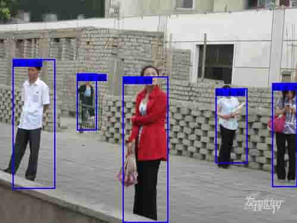
	make inference MODEL=yolo_mobilev1 DEPTHMUL=0.75 CKPT=asset/yolo_model.h5 IMG=data/dog.jpg
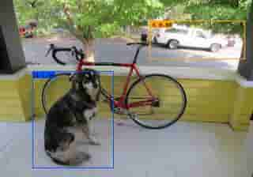

注：由于 anchors 是随机生成的，如果您的结果与上面的图像不同，你只需要加载这个模型并继续训练一段时间。

更多选项请参见`python3 ./keras_inference.py -h`

## 修剪模型

    make train MODEL=xxxx MAXEP=1 ILR=0.0003 DATASET=voc CLSNUM=20 BATCH=16 PRUNE=True CKPT=log/xxxxxx/yolo_model.h5 END_EPOCH=1

训练结束时，将模型保存为 log/xxxxxx/yolo_prune_model.h5.

## Freeze

    toco --output_file mobile_yolo.tflite --keras_model_file log/xxxxxx/yolo_model.h5

现在你有了 mobile_yolo.tflite

## 转换 Kmodel

Please refer <a href="https://github.com/kendryte/nncase/tree/v0.1.0-rc5">`nncase v0.1.0-RC5 example`</a>

    ncc mobile_yolo.tflite mobile_yolo.kmodel -i tflite -o k210model --dataset nncase_images

